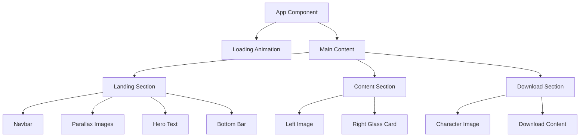

# 🎮 Grand Theft Auto VI - Promotional Landing Page

<div align="center">


A stunning, interactive promotional landing page for Grand Theft Auto VI, featuring immersive animations, parallax effects, and a modern glassmorphism design.

[🚀 Live Demo](#) | [📖 Documentation](#architecture) | [🔧 Installation](#getting-started)

</div>

---

## ✨ Features

- 🎨 **Immersive Animations** - Smooth GSAP-powered animations and transitions
- 🌊 **Parallax Effects** - Interactive parallax scrolling with mouse movement
- 💎 **Glassmorphism UI** - Modern glassmorphic design elements
- 📱 **Responsive Design** - Optimized for all screen sizes
- ⚡ **Lightning Fast** - Built with Vite for instant hot module replacement
- 🎯 **Smooth Scrolling** - Seamless navigation between sections
- 🌈 **Dynamic Visuals** - Gradient backgrounds and glowing effects
- 🎭 **Loading Animation** - Engaging VI mask reveal animation

---

## 🏗️ Architecture

### Project Structure

```
GTAVI/
├── public/                 # Static assets
│   ├── bg.png             # Background images
│   ├── sky.png            # Sky layer
│   ├── girlbg.png         # Character image
│   ├── download.png       # Download section character
│   ├── imag.png           # Content section image
│   ├── logo18.png         # Logo
│   ├── ps5.png            # PlayStation 5 logo
│   └── pricedown.otf      # Custom font
│
├── src/
│   ├── App.jsx            # Main application component
│   ├── main.jsx           # Application entry point
│   └── index.css          # Global styles & animations
│
├── index.html             # HTML template
├── vite.config.js         # Vite configuration
├── package.json           # Dependencies & scripts
└── vercel.json            # Vercel deployment config
```

### Technology Stack

#### Frontend Framework
- **React 19.1.0** - Latest React with concurrent features
- **Vite 6.3.5** - Next-generation frontend tooling

#### Styling
- **TailwindCSS 4.1.5** - Utility-first CSS framework
- **Custom CSS** - Glassmorphism effects and animations

#### Animation Libraries
- **GSAP 3** - Professional-grade animation library
- **@gsap/react** - React integration for GSAP

#### Icons
- **RemixIcon** - Beautiful icon library

### Component Architecture



### Key Features Implementation

#### 1. Loading Animation
- SVG mask animation using GSAP
- "VI" text reveal effect
- Smooth transition to main content

#### 2. Landing Section
- Multi-layer parallax background (sky, background, character)
- Interactive mouse movement effects
- Smooth scroll navigation
- Hero text with dramatic typography

#### 3. Content Section
- Two-column layout with image and glassmorphic card
- Content descriptions with engaging copy
- Call-to-action button with hover effects

#### 4. Download Section
- Intersection Observer for scroll-triggered animations
- Enhanced parallax effects
- Feature highlights with icons
- Gradient backgrounds with dynamic effects

### Animation Pipeline

```
Page Load
    ↓
SVG Mask Animation (GSAP Timeline)
    ↓
Content Reveal
    ↓
Parallax Initialization
    ↓
Mouse Movement Listeners
    ↓
Scroll Animations (Intersection Observer)
```

---

## 🚀 Getting Started

### Prerequisites

- **Node.js** 18.0 or higher
- **npm** 9.0 or higher (or **yarn** / **pnpm**)

### Installation

1. **Clone the repository**
   ```bash
   git clone https://github.com/yourusername/GTAVI.git
   cd GTAVI
   ```

2. **Install dependencies**
   ```bash
   npm install
   ```

3. **Start development server**
   ```bash
   npm run dev
   ```

4. **Open your browser**
   ```
   Navigate to http://localhost:5173
   ```

### Available Scripts

| Command | Description |
|---------|-------------|
| `npm run dev` | Start development server with HMR |
| `npm run build` | Build for production |
| `npm run preview` | Preview production build locally |
| `npm run lint` | Run ESLint for code quality |

---

## 🌐 Deployment

### Vercel Deployment

This project is optimized for Vercel deployment. Follow these simple steps:

#### Option 1: Deploy via Vercel CLI

1. **Install Vercel CLI** (if not already installed)
   ```bash
   npm i -g vercel
   ```

2. **Login to Vercel**
   ```bash
   vercel login
   ```

3. **Deploy**
   ```bash
   vercel
   ```

4. **Deploy to Production**
   ```bash
   vercel --prod
   ```

#### Option 2: Deploy via Vercel Dashboard

1. **Push your code to GitHub/GitLab/Bitbucket**

2. **Import your repository**
   - Go to [vercel.com](https://vercel.com)
   - Click "Add New Project"
   - Import your Git repository

3. **Configure Project Settings**
   - **Framework Preset**: Vite
   - **Root Directory**: `./`
   - **Build Command**: `npm run build`
   - **Output Directory**: `dist`
   - **Install Command**: `npm install`

4. **Deploy**
   - Click "Deploy"
   - Vercel will automatically build and deploy your project

#### Option 3: One-Click Deploy

[](https://vercel.com/new/clone?repository-url=https://github.com/yourusername/GTAVI)

### Environment Variables

Currently, no environment variables are required. If needed in the future, add them in:
- **Vercel Dashboard** → Your Project → Settings → Environment Variables

### Build Configuration

The project includes a `vercel.json` configuration file for optimal deployment:

- Automatic routing for SPA (Single Page Application)
- Proper headers for static assets
- Optimized caching strategies

---

## 🎨 Customization

### Changing Colors

Edit the TailwindCSS classes in `src/App.jsx` and `src/index.css`:

```jsx
// Example: Change primary button color
className="bg-yellow-500 hover:bg-yellow-400"
```

### Modifying Animations

Animation timings and effects are controlled by GSAP in `src/App.jsx`:

```javascript
// Example: Adjust animation duration
duration: 2, // Change this value
```

### Adding Sections

1. Create a new component following the pattern in `App.jsx`
2. Add smooth scroll navigation
3. Implement GSAP animations using `useGSAP` hook

---

## 📱 Browser Support

- ✅ Chrome (latest)
- ✅ Firefox (latest)
- ✅ Safari (latest)
- ✅ Edge (latest)
- ⚠️ IE11 (not supported)

---

## 🛠️ Development

### Code Style

This project uses ESLint for code quality. Run linting:

```bash
npm run lint
```

### File Naming Conventions

- Components: `PascalCase.jsx`
- Utilities: `camelCase.js`
- Constants: `UPPER_SNAKE_CASE.js`

---

## 📦 Dependencies

### Production Dependencies

| Package | Version | Purpose |
|---------|---------|---------|
| react | ^19.1.0 | UI library |
| react-dom | ^19.1.0 | React DOM renderer |
| @gsap/react | ^2.1.2 | GSAP React integration |
| tailwindcss | ^4.1.5 | CSS framework |
| remixicon | ^4.6.0 | Icon library |

### Development Dependencies

| Package | Version | Purpose |
|---------|---------|---------|
| vite | ^6.3.5 | Build tool |
| @vitejs/plugin-react | ^4.4.1 | React plugin for Vite |
| eslint | ^9.25.0 | Linting tool |

---

## 🤝 Contributing

Contributions are welcome! Please follow these steps:

1. Fork the repository
2. Create a feature branch (`git checkout -b feature/amazing-feature`)
3. Commit your changes (`git commit -m 'Add some amazing feature'`)
4. Push to the branch (`git push origin feature/amazing-feature`)
5. Open a Pull Request

---

## 📄 License

This project is licensed under the MIT License - see the LICENSE file for details.

---

## 👨‍💻 Author

**Your Name**

- GitHub: [@yourusername](https://github.com/yourusername)
- Email: your.email@example.com

---

## 🙏 Acknowledgments

- Rockstar Games for the GTA franchise inspiration
- GSAP team for amazing animation tools
- Vite team for the blazing-fast build tool
- TailwindCSS team for the utility-first CSS framework

---

<div align="center">

**Made with ❤️ and ⚡ by the GTA VI Landing Page Team**

[⬆ Back to Top](#-grand-theft-auto-vi---promotional-landing-page)

</div>
